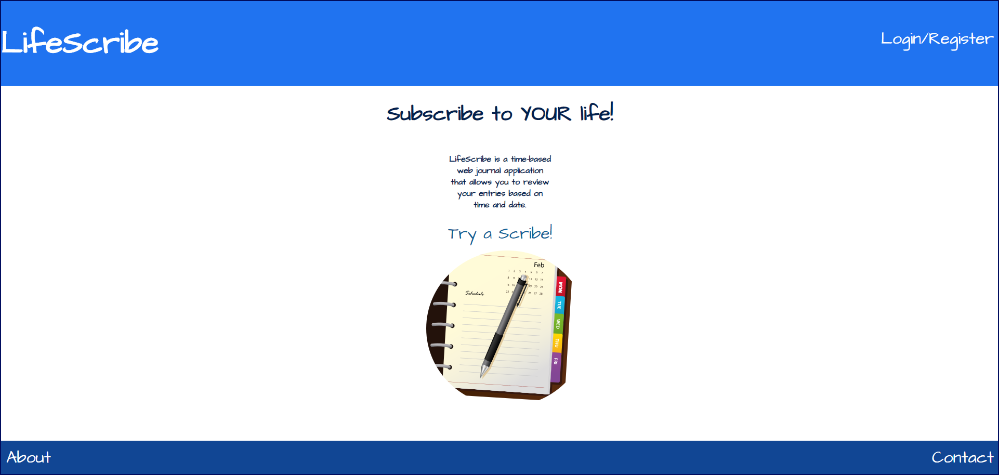
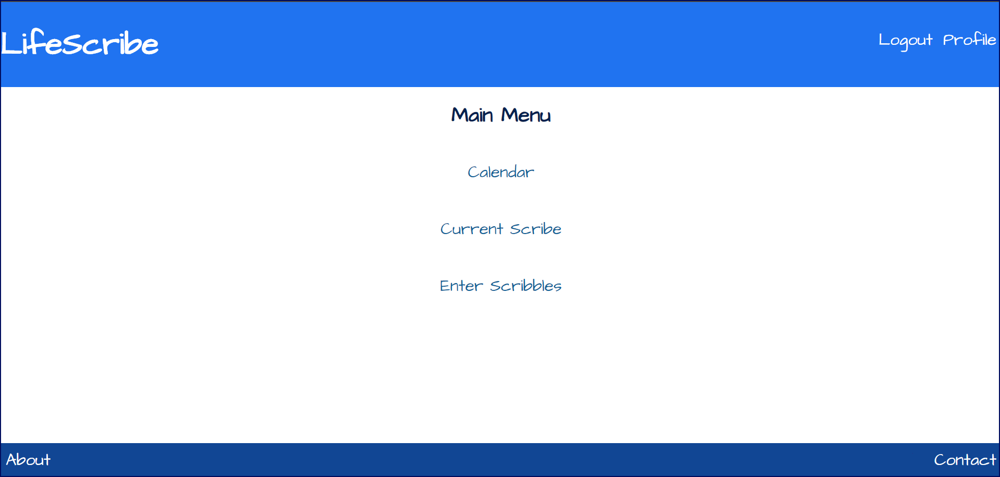
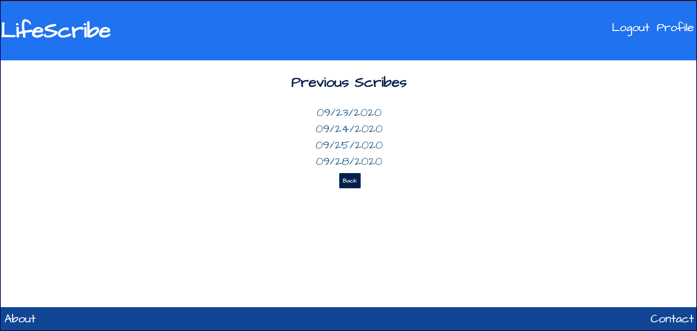
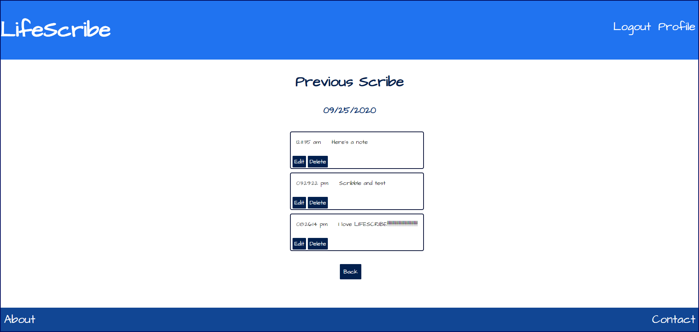
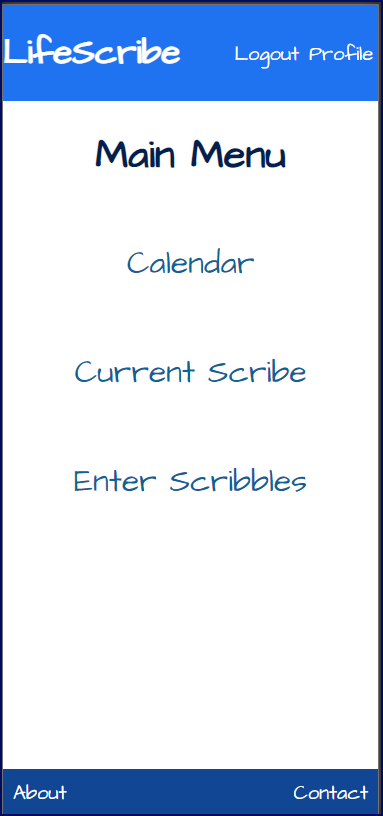
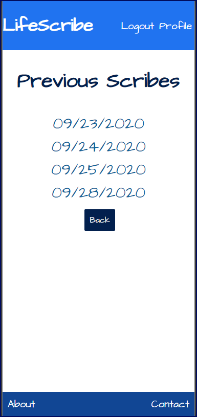
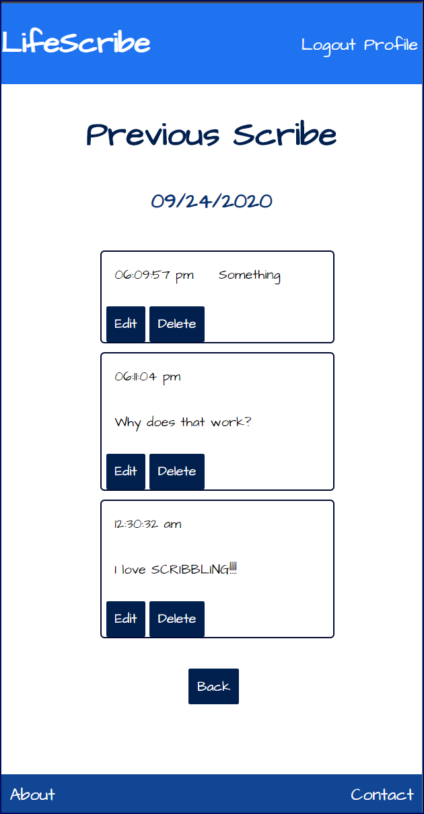
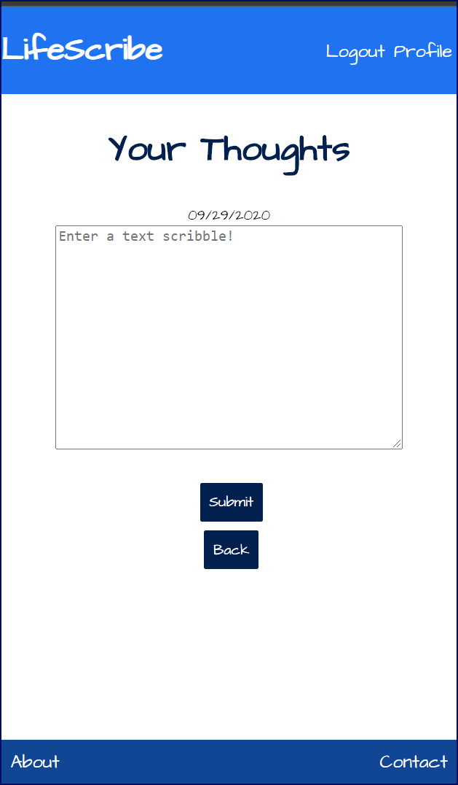

<h1 id="lifescribe">LifeScribe</h1>

[Here's the website](https://lifescribe.vercel.app/)

<h2 id="what-is-lifescribe">What is LifeScribe?</h2>

LifeScribe is an online web journal application in which users are able to log in and enter their thoughts (scribbles) and review them by day and time entered!

<h2 id="prerequisites">Prerequisites</h2>

Lifescribe requires Node.js 12.18+ to run.

<h2 id="installing">Installing</h2>

Lifescribe requires Node.js 12.18+ to run. Install the dependencies and devDependencies then start the server.

<pre><code>npm install
</code></pre>
<h2 id="running-the-tests">Running The Tests</h2>

To run front-end or back-end tests, simply run <code>npm t</code> in the terminal.

<h2 id="screenshots">Screenshots</h2>

<h2 id="built-withh2">Built With</h2>

React 
Node 
Express 
JWT 
Mocha 
Chai 
Enzyme 

## Authors
Michael Oldacre - Full Stack

## Acknowledgments</h2>

A great many thanks goes to Mark Lewis for all the help!

<blockquote>

Written with <a href="https://stackedit.io/">StackEdit</a>.

</blockquote>

<!--stackedit_data:
eyJoaXN0b3J5IjpbNDY5NDQ1OTQ2XX0=
-->
